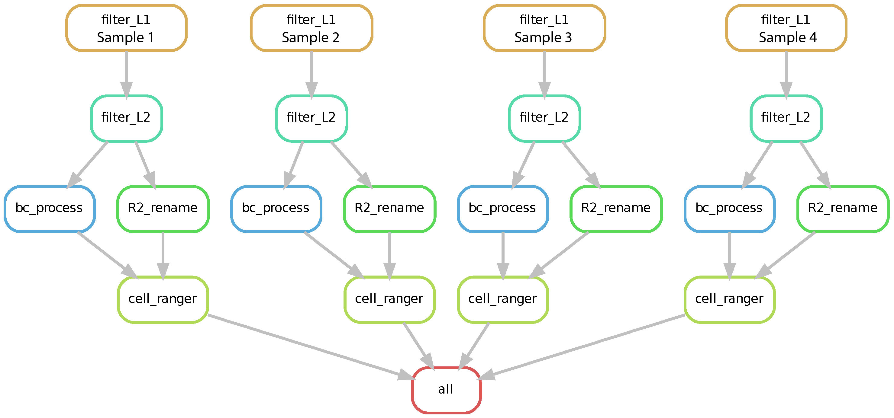

# 2024_ISB_workshop_Practical_Methods_in_Spatial-Omics
02/12/2024
Adapted from Dr. Mingyu Yang's GitHub  
https://github.com/MingyuYang-Yale/DBiT-seq  
https://github.com/MingyuYang-Yale/BENG469/tree/main/FA23

## Spatial folder generation
### Software
AtlasXomics Browser https://docs.atlasxomics.com/projects/AtlasXbrowser/en/latest/Overview.html   
### Manual selection
Credit to Dr. Yanxiang Deng  
Jupyter notebook code from: https://github.com/dyxmvp/Spatial_ATAC-seq  
Step-by-step instructions and demo files under 'Spatial_folder_generation' folder
   19. Use the jupyter notebook code _metadata_for_seurat.ipynb_ to generate the contents inside the "Spatial_folder_generation" folder


## Spatial RNA-Seq
Credit to Dr. Mingyu Yang, https://github.com/MingyuYang-Yale/BENG469/tree/main/FA23/Lab7-Spatial%20transcriptomics/2023-11-02
### Install [Stpipeline](https://github.com/SpatialTranscriptomicsResearch/st_pipeline):
```
module load miniconda
```
```
conda create -y -n st-pipeline python=3.7 Numpy Cython
```
```
conda activate st-pipeline
```
```
conda install -y -c bioconda star samtools
```
```
pip install 'pysam==0.15.4' taggd stpipeline
```
Test whether ST pipeline is installed successfully
```
st_pipeline_run.py -h
```
<p></p>

## Sptail ATAC-Seq
Using Cellranger to preprocess the raw data.  
Written by Dr. Di Zhang, Xing Lou  


### Dependiencies

* [Snakemake](https://snakemake.readthedocs.io/en/stable/index.html). snakemake is python3
* [Biopython](https://biopython.org/docs/1.75/api/index.html).
* [Cell Ranger ATAC](https://support.10xgenomics.com/single-cell-atac/software/pipelines/latest/installation). v1.2
* [BBMap](https://jgi.doe.gov/data-and-tools/bbtools/bb-tools-user-guide/installation-guide/).

### Run the pipeline
1. Replace the cellranger-atac-cs/1.2.0/lib/python/barcodes/737K-cratac-v1.txt with the new barcodes file in this fold.
2. Configure Snakefile
3. Configure cluster.json
4. Configure Snakemake.sh
5. Reformat raw Fastq file to Cell Ranger ATAC format (10x Genomics)
**Raw read 1 -> New Read 1 + New Read 2**
- New Read 1: contains the genome sequences
- New Read 2: contains the spatial Barcode A and Barcode B
**Raw read 2 -> New Read 3**
6. Reformatting raw data was implemented by _BC_process.py_ in the Data_preprocessing folder.  
Sequence alignment and generation of fragments file  
The reformated data was processed using Cell Ranger ATAC v1.2 with following references:  
Mouse reference (mm10):  
```
    curl -O https://cf.10xgenomics.com/supp/cell-atac/refdata-cellranger-atac-mm10-1.2.0.tar.gz
```
Human reference (GRCh38):
```
    curl -O https://cf.10xgenomics.com/supp/cell-atac/refdata-cellranger-atac-GRCh38-1.2.0.tar.gz
```
**A preprocessing pipeline we developed using Snakemake workflow management system is in the Data_preprocessing folder. To run the pipeline, use the command:**
```
    sbatch Snakemake.sh
```
## Sptail RNA-ATAC-Seq
Credit to Yao Lu
Squidpy to analyze the two datasets

## CODEX
segmentation
step1 & step2
step3 maxfuse
